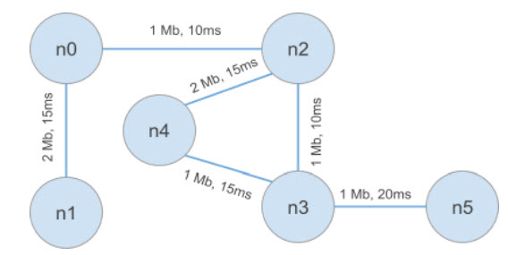

Here are 3 simple examples of working with NS2:

proc1: Defines a procedure as follows which takes two integer as arguments:
	proc1 (n, k) = n! + n * k

maxnum: Defines a function max_num that takes four integer as arguments, and returns the
maximum number between them:
	Example
	max_num (10, 4, 13, 5) −−−> 13

netsim: Simulation of the following network topology:
	cbr over UDP: n0 −−> n4, Rate: 800 kb/s, Packet Size: 1000
	ftp over TCP: n1 −−> n5

	

To run the code, enter the following commands:
	• ns FILE_NAME.tcl
To see the simulation:
	• ns netsim.tcl
	• nam out.nam